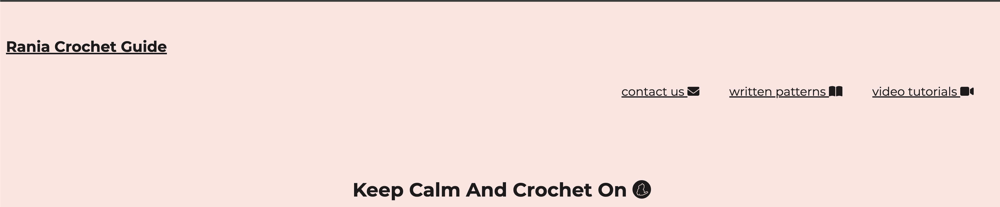
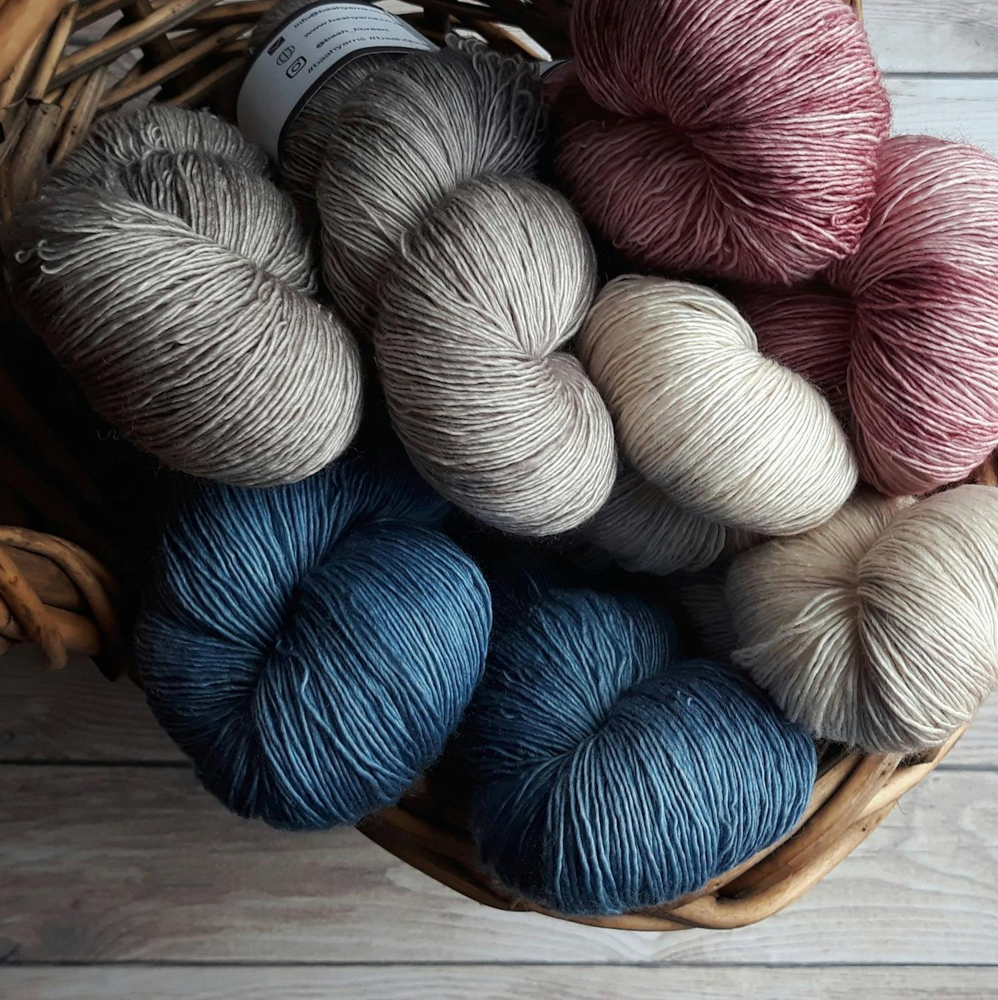
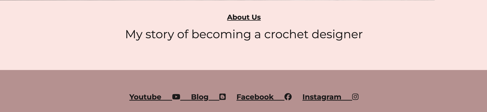
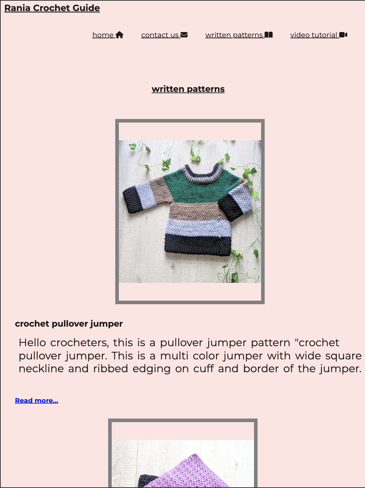
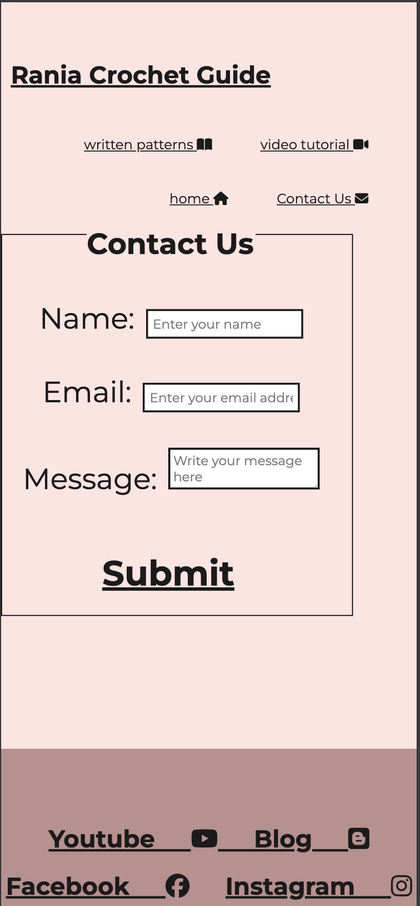
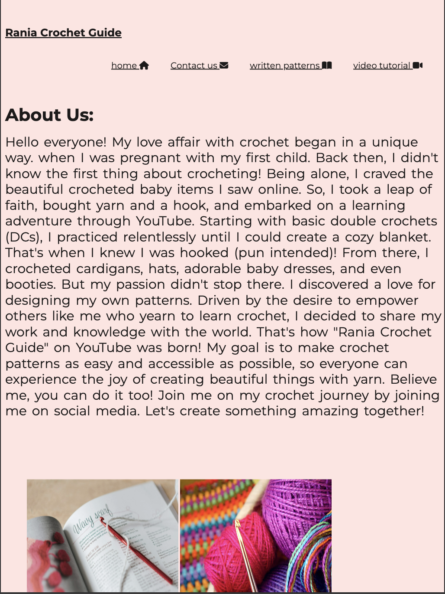

Welcome to Crochet-Guide!

I'm Rania, and crochet is my passion! This website is a space for me to share my love for the craft with you. Whether you're a seasoned crocheter or just picking up a hook for the first time, I hope you find something here to inspire you.

on this website you will see the logo on top left side "Rania Crochet Guide", it is linked to home page ,when you will click on it it will bring you to home page.
there is navigation bar on the right side representing three  pages of website "<a href="https://raheelaahmed.github.io/crochet-guide/contact-us.html">contact us" </a>, this page a form to contact the deignner by providing name,email and a message.,message will be sent through submit button(you will get thankyou for contacting us message) by clicking submit button which is connected to a hidden webpage"submit-form.html",  <a href="https://raheelaahmed.github.io/crochet-guide/written-patterns.html">
"written patterns"</a>
written pattern is a webpage have pictures of crochet item made by "Rania Crochet Guide" introduction of crochet pattern and there is a linked file "see more..."  for full pattern that will open in a new tab. <a href="https://raheelaahmed.github.io/crochet-guide/video-tutorials.html">"video tutorial"</a>.this is a webpage of this website that have video turtorials for crochet items by"Rania Crochet Guide".you can see full width video on any screen mobile or desktop.it has animation feature of video zooming when hover over. 
On all the other pages axcept home page there is one more icon "Home", that is linked to home page.
i have used font awesome icons with them.
there is a tag line on the top of hero image"Keep Calm And Crochet On". ihave used font awesome icons with it and css for styling.

Above picture is used as hero image for home page.it has perfact sahdes to go with backgorund and footer.
 below picture you can find more about designer of "Rania Crochet Guide" with a linked page <a href="https://raheelaahmed.github.io/crochet-guide/About-me.html">"About Us"</a>this is a webpage that has story of the deigner and some colorfull pictures.
 
 
 

 at the bottom of page you can find all the social media links,when clicked they will open in a seprate browser.

 source of Images:
 
 I used free images from "FreeImages.com", "unsplash.com", "istockphoto.com", "pexels.com" and
images  and videos that i  have used with patterns belong to Rania Crochet Guide.

icons and font:
 font awesome and google font  are used for styling the website.

colors pallets:

I have choosen shades of dusty pink for my website. hero pictures on main page "https://raheelaahmed.github.io/crochet-guide/index.html" has similar shades and matching background colors is used for footer as well. I have used basic color palete on css for designing the website.

all the webpage of the website share a common design for top and bottom of the page.

Copyright:

All patterns and content on this website are copyrighted by Rania Crochet Guide. 

Thnakyou

Thank you for visiting my website! I hope you find something here that sparks your creativity and brings you joy. Happy crocheting!

share

Rania Crochet Guide
